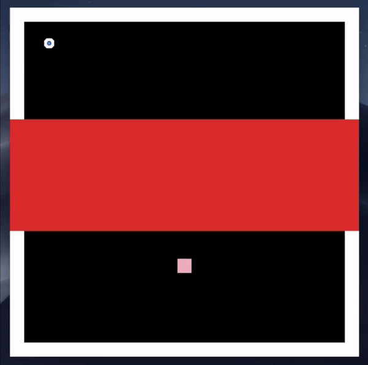
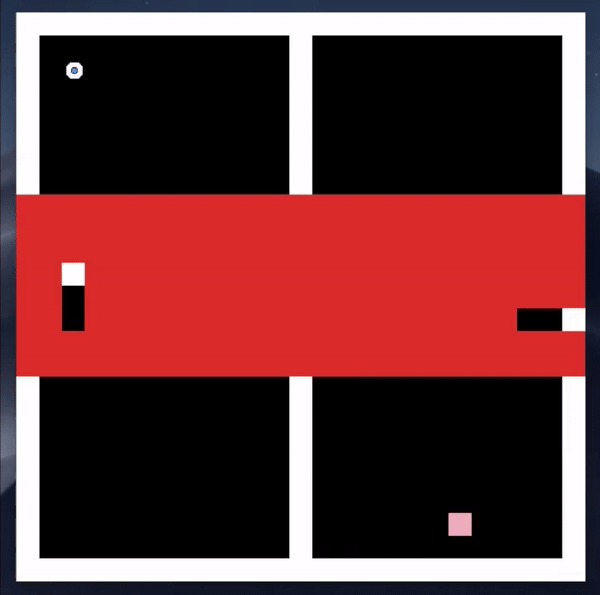
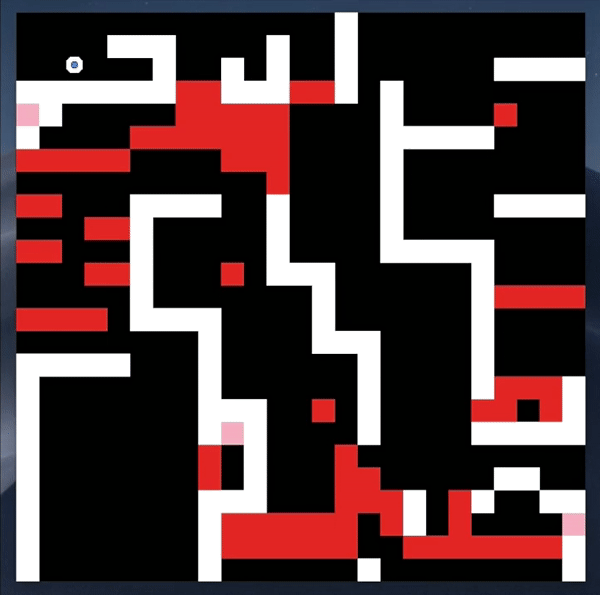

# Personal Project

Hi there! THis is my first personal project where I recreate the Valve puzzle based video game Portal into a 2d maze game. Made without a game engine, the game operates in real time 

Implemented with Observer, Observeable and Composite design patterns. Try/Catch Exceptions and JUnit tests written for more robust coding. 

##**Rules:** 
Navigate your character (Atlas) through the maze by reaching the pink checkpoint. Use your portal gun, to teleport through previously unaccessible parts of the maze. Please note that walking through Lava does kill you! (Asked a friend and they confirmed that walking through lava in real life results in a world of pain) 

##**Controls**
•WASD to move forward, left, backward, right.

•Q to fire blue portal.

•E to fire orange portal.

•M to observe players in the main view.

•N to observe players in the picture-in-picture view.

•X to quit game.

##Gameplay Footage 

### **Moving Character**

### **Traversing through level 1**

### **Traversing through level 2**

